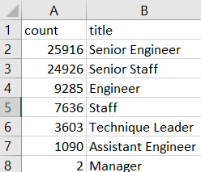

# Pewlett-Hackard-Analysis

## Overview
The purpose of this analysis is to predict the workforce attrition in older employees.

## Results

### Retirement Data
1. There are 72458 employees currently employed who are likely about to retire.
2. The ranking of those who are most likely to leave, by title, is as followed: Senior Engineer>Senior Staff>Engineer>Staff>Technique Leader>Assistant>Manager. The picture below highlights the relative scale.

### Mentorship Data
1. There are 1549 employees who fit the criteria for mentorship. (Born in '65 and are still employed).
2. All of the employees who are fit for mentorship were born in January.

## Summary
1. To prepare for the incoming silver tsunami, the data suggests 72,458 new employees will need to be hired.
2. Considering that there are only 1549 mentorship qualified employees, it is unlikely that they will be able to mentor all of the backfill hires. It would be better to widen the mentorship parameters for now until more employees have been trained up (or aged enough) to mentor.
